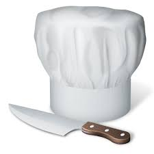

# Jeu d'Anagramme Culinaire 3D

Bienvenue dans le Jeu d'Anagramme Culinaire en 3D ! Ce projet est une application interactive qui vous permet de résoudre des anagrammes culinaires en utilisant la technologie WebGL 3D. Vous pouvez également suivre votre score et passer au mot suivant lorsque vous résolvez un anagramme.

## Comment jouer

1. Clonez ou téléchargez ce repository sur votre ordinateur.

2. Ouvrez le fichier `index.html` dans votre navigateur web pour démarrer le jeu.

3. Résolvez les anagrammes en cliquant sur les lettres pour les permuter.

4. Double-cliquez sur l'anagramme résolu pour gagner des points.

5. Le jeu passera automatiquement au mot suivant après un délai.

## Fonctionnalités

- Résolution d'anagrammes culinaires.
- Affichage du score.
- Passage automatique au mot suivant.
- Effets sonores pour les actions du joueur.

## Développement

Ce projet utilise les technologies suivantes :

- [Three.js](https://threejs.org/) pour la création de la scène 3D.
- [Howler.js](https://howlerjs.com/) pour la gestion des effets sonores.

Le code source est organisé de la manière suivante :

- `index.html`: Structure de la page HTML.
- `styles.css`: Styles CSS pour la mise en page.
- `app.js`: Logique JavaScript du jeu.
- Fichiers audio `click.mp3` et `success.mp3` pour les effets sonores.

## Personnalisation

Vous pouvez personnaliser ce jeu en ajoutant de nouveaux mots et anagrammes à la liste `foodList` dans le fichier `app.js`. Vous pouvez également ajuster les effets sonores et les styles CSS pour correspondre à votre vision du jeu.

## Auteur

Ce jeu a été créé par [Doric Ngouffo].

## Licence

Ce projet est sous licence MIT. Vous pouvez en savoir plus dans le fichier `LICENSE`.
